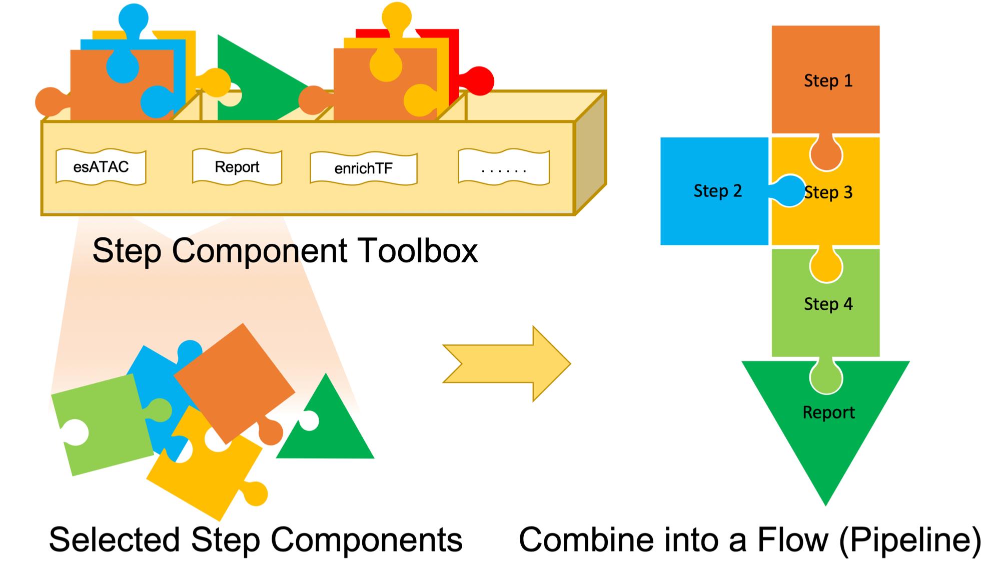

```{r setup, include=FALSE}
knitr::opts_chunk$set(echo = TRUE, warning=FALSE, message=FALSE)
```

# What is pipeFrame
pipeFrame is an R package for building a componentized bioinformatics pipeline.
Each step in this pipeline is wrapped in the framework, so the connection among steps is created seamlessly and automatically.
Users could focus more on fine-tuning arguments rather than spending a lot of time on transforming file format, passing task outputs to task inputs or installing the dependencies.
Componentized step elements can be customized into other new pipelines flexibly as well. 
This pipeline can be split into several important functional steps,
so it is much easier for users to understand the complex arguments from each step 
rather than parameter combination from the whole pipeline. 
At the same time, componentized pipeline can restart at the breakpoint and avoid rerunning the whole pipeline,
which may save a lot of time for users on pipeline tuning or such issues as power off or process other interrupts.



# Download and Installation

The package pipeFrame is part of Bioconductor project starting from Bioc 3.9 built on R 3.5. To install the latest version of pipeFrame, please check your current Bioconductor version and R version first. The latest version of R is recommended, and then you can download and install pipeFrame and all its dependencies as follows:

```{r eval=FALSE}
if (!requireNamespace("BiocManager", quietly=TRUE))
    install.packages("BiocManager")
BiocManager::install("pipeFrame")

```

Similar with other R packages, please load pipeFrame as follows: 
```{r}
library(pipeFrame)
```

# Build the pipeline

## Initialize

Before building your pipeline, please initialize the configuration. 

For general users, calling the function `initPipeFrame` is required after library the package.

```{r eval=FALSE}
initPipeFrame(availableGenome = c("hg19", "hg38", "mm9", "mm10"),
              defaultJobName = "test-pipeline"
)

```

For package developers, as the function `.onload` is called automatically when a new package is loading, the pipeFrame initialization is set when the function `.onLoad` is implemented as follows.

```{r}

.onLoad <- function(libname, pkgname) {
    initPipeFrame(availableGenome = c("hg19", "hg38", "mm9", "mm10"),
                  defaultJobName = paste0(pkgname,"-pipeline")
    )
}

```

In this function, several parameters need to be defined and configured, including genome, job name, reference directory, temporary directory, check and install function, threads number, reference list, etc. In the following section, we will go through them in more details.

## Configuration

For the default configuration, the directory of files is organized in this way:

* Working Directory/ (Temporary Directory)
    + pkgname-pipeline/ (Job name)
        - Step_00_FirstStepName_pipe/
        - Step_01_SecondStepName_pipe/
        - Step_02_ThirdStepName_pipe/
        - ...
    + refdir (Reference genome directory, which could be set by calling the function 'setGenome')
        - hg19/ (Human reference genome files (e.g. hg19.fa) are stored here)
        - hg38/
        - mm10/
        - mm9/
        - ...
        
### Temporary Directory

By default, the temporary directory is set as the current working directory.
It could be modified by the function `initPipeFrame` with argument `defaultTmpDir`. 
Typically, all intermediate results for one job will be stored at the sub-directory named after this job.
Users can get the full pathname by calling the function:

```{r}
# display current temporary directory
getTmpDir()
```
Users can customize the temporary directory in this way:
```{r}
dir.create("./testdir")
# set a new temporary directory
setTmpDir("./testdir")

# display the new temporary directory
getTmpDir()
```

### Reference Directory

The default reference directory is under the temporary directory. It could be modified by the function `initPipeFrame` with argument `defaultRefDir`. All of the reference data will be stored at the sub-directory named after the reference genome version, respectively.
Users can get the full pathname by calling the function:
```{r}
# display current reference directory
getRefDir()
```
Users can customize the reference directory in this way:
```{r}
# set a new reference directory
setRefDir("./testdir")

# display the new reference directory
getRefDir()
```


### Genome Annotation

Usually, only several genome assemblies are available for the pipeline. The pipeline builders need to specify which genome assemblies are available. It can be set by the argument `availableGenome` in the `initPipeFrame` function.
Users can obtain the available genome assemblies:

```{r}
getValidGenome()

```

Users can configure currently genome assembly by:
```{r}

setGenome("hg19")

#display the current configured genome
getGenome()

```

If the genome is not available, a stop message will prumpt.


### Reference Data Generation

Users usually select only one specific genome assembly, so it would be more efficient to generate the reference data for this specific genome rather than all available genome assemblies. 

There are two options to generate reference data.1) For any R objects reference data shared by all genome assemblies (e.g. motif PWMs for vertebrate), they can be set by the argument `defaultReference` in the `initPipeFrame` function as a list member.
Users can use `getRef("itemName")` to obtain the reference data.2) In other cases, please implement a function and pass it to the argument `defaultCheckAndInstallFunc` in the function `initPipeFrame`. There are two steps.

First, implement a function for argument `defaultReference`. Here we show how to install BSgenome package for a specific genome assembly and generate its FASTA file.  `checkAndInstall` needs to call several installation functions (e.g. `checkAndInstallBSgenome` and `checkAndInstallGenomeFa`) by `runWithFinishCheck`. Users assign a reference name (`refName`) and file/folder name (`refFilePath`) in the reference directory such as “path/to/refdir/hg19/”. This function can detect break point if the installation is not complete and skip the item that has already been generated or installed.

```{r}
checkAndInstall <- function(){
    runWithFinishCheck(func = checkAndInstallBSgenome,refName = "bsgenome")
    runWithFinishCheck(func = checkAndInstallGenomeFa,refName = "fasta", refFilePath = "genome.fa")
}

```
       
Second, implement functions for installation or data generation with the argument `refFilePath`. 


For BSgenome installation:
```{r}
checkAndInstallBSgenome <- function(refFilePath){
    genome <- getGenome()
    bsgenomename<- BSgenome::available.genomes()[grepl(paste0(genome,"$"),BSgenome::available.genomes())]
    if(length(bsgenomename)==0){
        stop("BSgenome does not support this genome")
    }
    bsgenomeinstall <- BSgenome::installed.genomes()[grepl(paste0(genome,"$"),BSgenome::installed.genomes())]
    if(length(bsgenomeinstall)==0){
        message(paste("BSgenome for ",genome,"has not been installed,"))
        message("begin to install ...")
        BiocManager::install(bsgenomename)
    }
    return(getBSgenome(bsgenomename))
}
```
In this example, the code will check if BSgenome is available for this genome and install the corresponding BSgenome package.  `refFilePath` can be ignored because no files will be generated. The function returns the BSgenome object as the resource of the reference name. So in the next example, use `getRefRc("bsgenome")` to obtain this object.

For genome sequence FASTA file generation:
```{r}
checkAndInstallGenomeFa <- function(refFilePath){
    outFile <- refFilePath
    bsgenome<-getRefRc("bsgenome")
    if(!is(bsgenome, "BSgenome")){stop("The variable 'bsgenome' is not a BSgenome")}
    append <- FALSE
    for(chrT in seqnames(bsgenome)){
        if(is.null(masks(bsgenome[[chrT]])))
            chrSeq <- DNAStringSet(bsgenome[[chrT]])
        else
            chrSeq <- DNAStringSet(injectHardMask(bsgenome[[chrT]], letter="N"))
        names(chrSeq) <- chrT
        writeXStringSet(chrSeq, filepath=outFile, format="fasta", append=append)
        append <- TRUE
    }
    return(NULL)
}
```
In this example, the FASTA file can be generated based on BSgenome object. It needs to be stored at `refFilePath`. So the steps in the pipeline can obtain the reference directory by `getRefFile('fasta')`.
It does not return any value because there is no R object generated.


Finally, the function can be passed to the initialization function:

```{r}
initPipeFrame(availableGenome = c("hg19", "hg38", "mm9", "mm10"),
              defaultJobName = "test-pipeline",
              defaultCheckAndInstallFunc = checkAndInstall
)

```

When users call  `setGenome("hg19")` to configure genome, this function will be called and the corresponding reference data will be installed.


### Threads

For multi-core processors, multi-thread program could make full use of CPUs. 
It can be set in the function `initPipeFrame` with argument `defaultThreads`. 
User can get the currently available max threads like this:
```{r}
# check the max user thread limit
getThreads()
```
Users can customize the max threads number in this way:
```{r}
# customize the max threads number
setThreads(4)

# check the max user thread limit
getThreads()
```

### Job Name

Intermediate results will be stored in a folder with the job name under the temporary directory.

It is set in the function `initPipeFrame` with argument `defaultJobName`. 
Users can get the current job name in this way:
```{r}
# display the current job name
getJobName()
```
Users can customize the job name in this way:
```{r}
# set a new job name
setJobName("testJobName")

# display the new job name
getJobName()

getJobDir()
```


## Step Restriction and Graph Management

The step relations are managed and restricted to directed acyclic graph. The direction of data flow is from upstream to downstream. So when users create a new step object, restricting its relation with existing steps is necessary.

For example, if a two-step pipeline is under development, it should be restricted in this way:

```{r}

addEdges(edges = c("RandomRegionOnGenome","OverlappedRandomRegion"),argOrder = 1)
```

 `argOrder` will tell the order of upstream step in the graph when it transfers to the downstream step. This will be important and informative when there are more than one upstream steps for a downstream object, which helps the `Step` method distinguish them.

For package development, this function should be called in the `.onLoad` function


## Step Componentization

Each step should be properly wrapped in the pipeline framework to make the connections among steps seamless. The framework is the `Step` base class. The `Step` objects contain the basic organized information for each step such as input directories, output directories, other parameters etc. All other customized steps must inherit from this class which is also the wrapper. Creating a new step needs to follow the following rules.


### Non-object Function Wrapper

As many users may not be familiar with the definition of class or object, a function wrapper for the object generator is necessary. In the above example, the two-step pipeline randomly generates regions on the whole genome in the first step and finds out regions overlapped with known regions. Each step can be used individually or as the first step for downstream steps. 
So the two functions are shown as below. 

For step `RandomRegionOnGenome` class, only sampleNumb is required. 
All other arguments could be set by default, as `genome` can be obtained from getGenome and `outputBed` can be generated automatically.
In this wrapper, all the parameters from the function are put in one `list` to generate the `RandomRegionOnGenome` class. Finally, the step object should be returned.


```{r}
randomRegionOnGenome <- function(sampleNumb, regionLen = 1000, genome = NULL, outputBed = NULL, ...){
    allpara <- c(list(Class = "RandomRegionOnGenome"),as.list(environment()),list(...))
    step <- do.call(new,allpara)
    invisible(step)
}

```
For the `OverlappedRandomRegion` class, it is very similar. Only `inputBed` and `randomBed` are required.
```{r}

overlappedRandomRegion <- function(inputBed, randomBed, outputBed = NULL, ...){
    allpara <- c(list(Class = "OverlappedRandomRegion"),as.list(environment()),list(...))
    step <- do.call(new,allpara)
    invisible(step)
}
```

As `OverlappedRandomRegion` can be the next step of `RandomRegionOnGenome`, another function wrapper is needed for seamless data transfer. Firstly, a generic interface should be declared. All of the parameters are the same except for the prevStep. Besides, the randomBed is no longer necessary as it can be obtained from prevStep object.

```{r}
setGeneric("runOverlappedRandomRegion",function(prevStep,
                                                inputBed,
                                                randomBed = NULL,
                                                outputBed = NULL,
                                                ...) standardGeneric("runOverlappedRandomRegion"))

```

Secondly, a `Step` method should be declared. One more parameter `prevStep` needs to be passed to `OverlappedRandomRegion` generator.

```{r}
setMethod(
    f = "runOverlappedRandomRegion",
    signature = "Step",
    definition = function(prevStep,
                          inputBed,
                          randomBed = NULL,
                          outputBed = NULL,
                          ...){
        allpara <- c(list(Class = "OverlappedRandomRegion", prevSteps = list(prevStep)),as.list(environment()),list(...))
        step <- do.call(new,allpara)
        invisible(step)
    }
)

```

In this way, users do not need to get familiar with the definition of classes or objects, and could build the pipeline easily:

```{r eval=FALSE}
library(magrittr)

testInputBedFilePath <- system.file(package = "pipeFrame", "extdata","testRegion.bed")

result <- randomRegionOnGenome(1000) %>%
    runOverlappedRandomRegion(inputBed = testInputBedFilePath)

```

Or use the function indiviually:

```{r eval=FALSE}
result1 <- randomRegionOnGenome(1000)

result2 <- runOverlappedRandomRegion(inputBed = testInputBedFilePath, randomBed = testInputBedFilePath)

```

Currently the classes have not been implemented yet, so these functions are still not available.

### Class Implementation

First, to declare classes, they are required to be inherit from `Step`.

Two step classes are shown as below as an example


```{r}
# generate new Step : RandomRegionOnGenome
setClass(Class = "RandomRegionOnGenome",
         contains = "Step"
)

# generate another new Step : OverlappedRandomRegion
setClass(Class = "OverlappedRandomRegion",
         contains = "Step"
)
```

Second, to initialize parameters, `init` of `Step` method is required to be override.
It includes three arguments, of which `.Object` is the object itself, `prevSteps` is the prior `Step` object that is required, and `...` contains all parameters passed from wrapper function. In this function, the pipeline developers need to fill the three list objects including `.Object@inputList` (all input directories or R objects), `.Object@outputList` (all output directories or R objects) and `.Object@paramList` (other parameters) based on the given arguments.


Here are some tips:

* Use `list(...)` to obtain all parameters passed from the wrapper
* If there are prevSteps for this step, use `getParam(prevStep,"outputListKey")` to obtain the output to fill inputList object
* All output file directories should be generated by default in the step intermediate result directory, which can be obtained by getStepWorkDir(.Object,"defaultOutputFileName")
* If the name of output file is based on the name of input file, use `getAutoPath(.Object,.Object@inputList[["theInputKey"]],"suffixToBeRemoved","newSuffixToBeReplacedc")`
* Input, output and other parameters should be filled in correct formats.
* The dependent input reference files or objects should be filled with `getRef`, `getRefRc`, `getRefFiles` or `getGenome` when the arguments are set with `NULL` or other default values. So when users configure the genome assembly, these arguments are actually not required.
* Return .Object at the end of the method

All tips can be found in the following two examples.
```{r}
setMethod(
    f = "init",
    signature = "RandomRegionOnGenome",
    definition = function(.Object,prevSteps = list(),...){
        # All arguments in function randomRegionOnGenome will be passed from "..."
        # so get the arguments from "..." first.
        allparam <- list(...)
        sampleNumb <- allparam[["sampleNumb"]]
        regionLen <- allparam[["regionLen"]]
        genome <- allparam[["genome"]]
        outputBed <- allparam[["outputBed"]]
        # no previous steps for this step so ingnore the "prevSteps"
        # begin to set input parameters
        # no input for this step
        # begin to set output parameters
        if(is.null(outputBed)){
            .Object@outputList$outputBed <-  getStepWorkDir(.Object,"random.bed")
        }else{
            .Object@outputList$outputBed <- outputBed
        }
        # begin to set other parameters
        .Object@paramList$regionLen <- regionLen
        .Object@paramList$sampleNumb <- sampleNumb
        if(is.null(genome)){
            .Object@paramList$bsgenome <- getBSgenome(getGenome())
        }else{
            .Object@paramList$bsgenome <- getBSgenome(genome)
        }
        # don't forget to return .Object
        .Object
    }
)


setMethod(
    f = "init",
    signature = "OverlappedRandomRegion",
    definition = function(.Object,prevSteps = list(),...){
        # All arguments in function overlappedRandomRegion and runOerlappedRandomRegion will be passed from "..."
        # so get the arguments from "..." first.
        allparam <- list(...)
        inputBed <- allparam[["inputBed"]]
        randomBed <- allparam[["randomBed"]]
        outputBed <- allparam[["outputBed"]]
        # inputBed can obtain from previous step object when running runOerlappedRandomRegion
        if(length(prevSteps)>0){
            prevStep <- prevSteps[[1]]
            .Object@inputList$randomBed <- getParam(prevStep,"outputBed")
        }
        # begin to set input parameters
        if(!is.null(inputBed)){
            .Object@inputList$inputBed <- inputBed
        }
        if(!is.null(randomBed)){
            .Object@inputList$randomBed <- randomBed
        }
        # begin to set output parameters
        # the output is recemended to set under the step work directory
        if(!is.null(outputBed)){
            .Object@outputList$outputBed <- outputBed
        }else{
            .Object@outputList$outputBed <- getAutoPath(.Object,.Object@inputList$inputBed, "bed", suffix = "bed")
            # the path can also be generate in this way
            # ib <- getParam(.Object,"inputBed")
            #.Object@outputList$outputBed <- file.path(getStepWorkDir(.Object),paste0(substring(ib,1,nchar(ib)-3), "bed"))
        }
        # begin to set other parameters
        # no other parameters
        # don't forget to return .Object


        .Object
    }
)

```


Third, to process the data, `processing` of `Step` method is required to be override.
It contains two arguments, `.Object` and `...`. `.Object` is the object itself, and `...` is currently unused and for future extension. In this function, the pipeline developers need to implement the core calculation algorithm and save the result objects or files to configure the output directory.

Here are some tips:

* Display the parameters including input, output and others by `getParam(.Object, "the key name")`
* Return .Object at the end of the method


```{r}

setMethod(
    f = "processing",
    signature = "RandomRegionOnGenome",
    definition = function(.Object,...){
        # All arguments are set in .Object
        # so we can get them from .Object
        sampleNumb <- getParam(.Object,"sampleNumb")
        regionLen <- getParam(.Object,"regionLen")
        bsgenome <- getParam(.Object,"bsgenome")
        outputBed <- getParam(.Object,"outputBed")
        # begin the calculation
        chrlens <-seqlengths(bsgenome)
        selchr <- grep("_|M",names(chrlens),invert=TRUE)
        chrlens <- chrlens[selchr]
        startchrlens <- chrlens - regionLen
        spchrs <- sample(x = names(startchrlens),size =  sampleNumb, replace = TRUE, prob = startchrlens / sum(startchrlens))
        gr <- GRanges()
        for(chr in names(startchrlens)){
            startpt <- sample(x = 1:startchrlens[chr],size = sum(spchrs == chr),replace = FALSE)
            gr <- c(gr,GRanges(seqnames = chr, ranges = IRanges(start = startpt, width = 1000)))
        }
        result <- sort(gr,ignore.strand=TRUE)
        rtracklayer::export.bed(object = result, con =  outputBed)
        # don't forget to return .Object
        .Object
    }
)


setMethod(
    f = "processing",
    signature = "OverlappedRandomRegion",
    definition = function(.Object,...){
        # All arguments are set in .Object
        # so we can get them from .Object
        allparam <- list(...)
        inputBed <- getParam(.Object,"inputBed")
        randomBed <- getParam(.Object,"randomBed")
        outputBed <- getParam(.Object,"outputBed")

        # begin the calculation
        gr1 <- import.bed(con = inputBed)
        gr2 <- import.bed(con = randomBed)
        gr <- second(findOverlapPairs(gr1,gr2))
        export.bed(gr,con = outputBed)
        # don't forget to return .Object
        .Object
    }
)
```


# Session Information

```{r}
sessionInfo()
```


